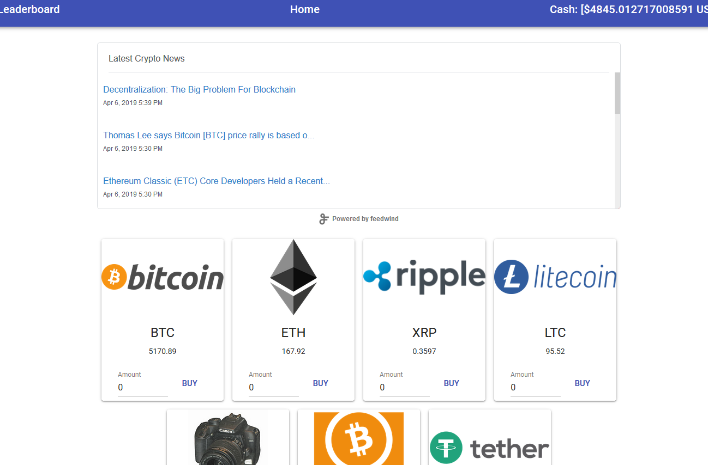

I Built a site that allows registered users to try to have the highest portfolio worth by buying and selling the 7 largest cryptocurrencies (Based on Market cap when I started this project). This was built initially using Node/Express/SQL (With Sequelize as the ORM) and then re-written using Spring/Boot so that I could gain some experience working with that. 

The main features are: User Login/Registration, Tracking of user activity (Purchases, sales, portfolios), and calculating the current value of someones portfolio. I use the Cryptocompare API to get up to date pricing, and in the node version I send the data to the user pre-processed, but in the Java version I have the user's PC calculate the value of a portfolio (This is because working with JSON in Java is much more difficult than it is in JavaScript, but that makes sense). When it comes to purchases both the Node and Java servers pull pricing themselves before completing a sale/purchase (Otherwise you need to trust that the user is POSTing valid data, which felt like I should avoid.)

The UI was built using React and Material UI, and it uses Axios to connect to the API to grab data. The frontend built for the node version was slightly re-written to work with Java, largely because of some odd issues I was having with how data was sent/returned to the java server (One example is that the server didnt seem to handle JSON requests in any way that made sense to me, so I changed the type of request it made.)

 [Java Repo](https://github.com/jorlee92/crypto-project-java)  
 [JavaScript Repo](https://github.com/jorlee92/react-bitcoin-market)
